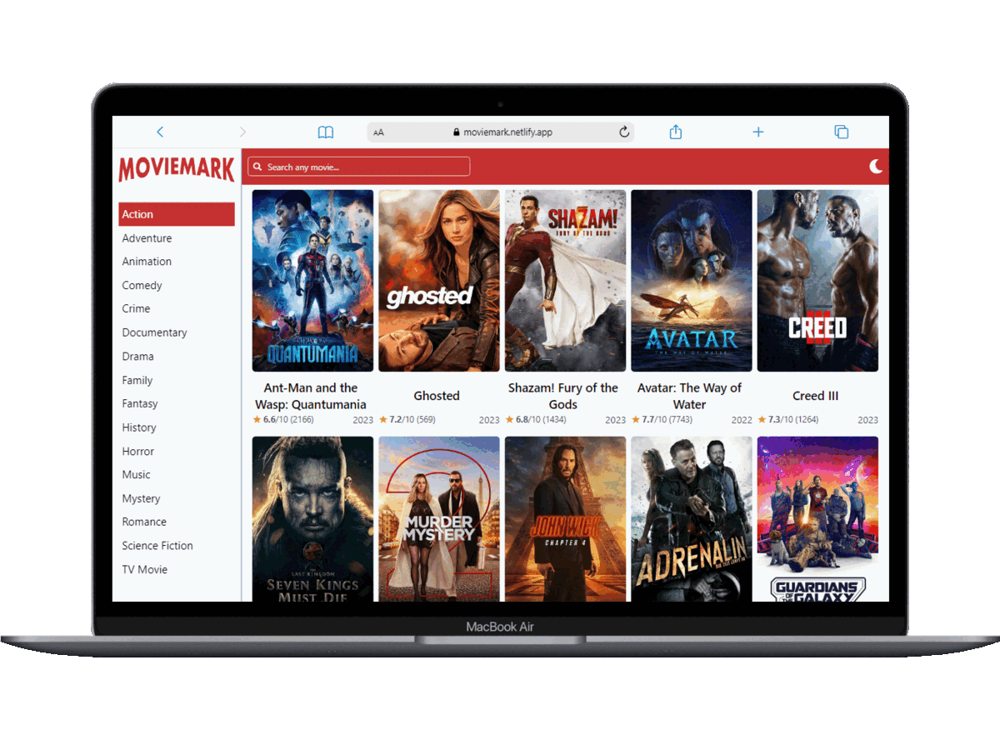

# Movie Mark

Movie Mark is a movie search web application developed using React.js, Redux and Chakra UI.

## 🔗 Deployed Link

### [Live Link](https://moviemark.netlify.app/ "Live")

## ✨ Features

- Get movie list based on genre
- View details of a movie
- View similar movies
- Search for movies
- Light/dark mode
- Pagination
- Responsive UI

## 📷 Sreenshots

## 👨🏻‍💻 Tech Used

### Frontend

### Tools

### Hosting

